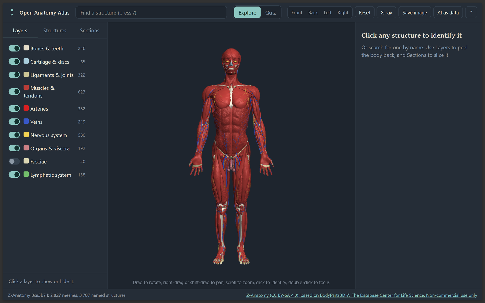
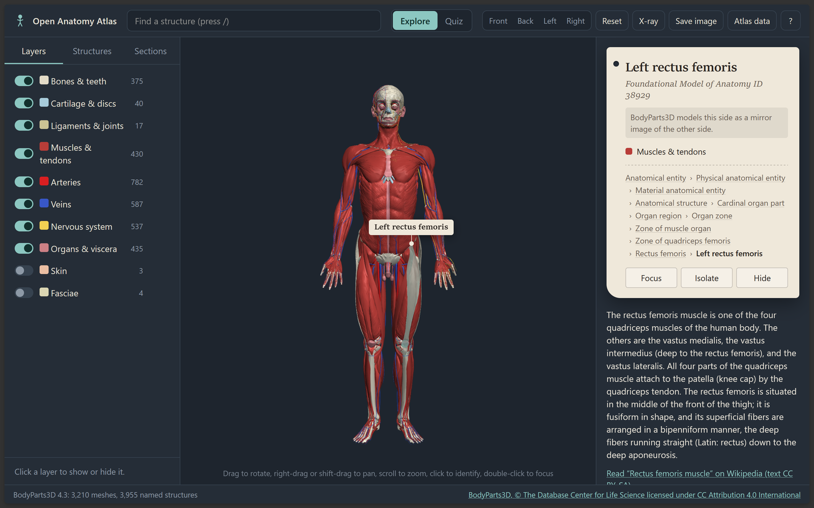
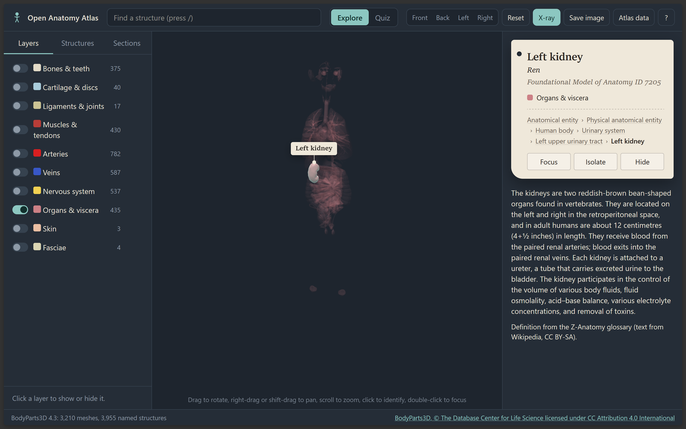
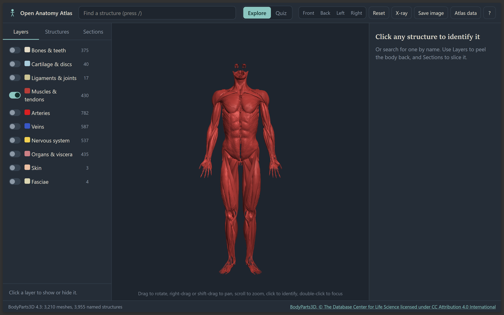
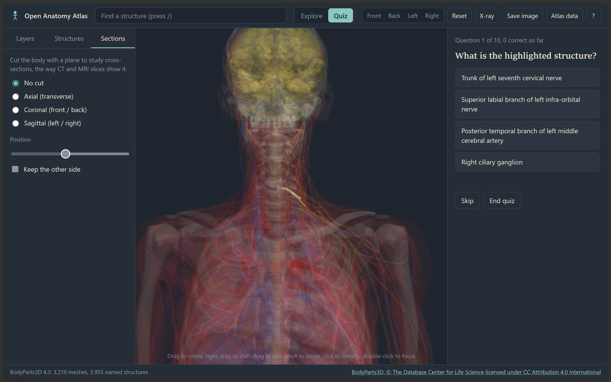
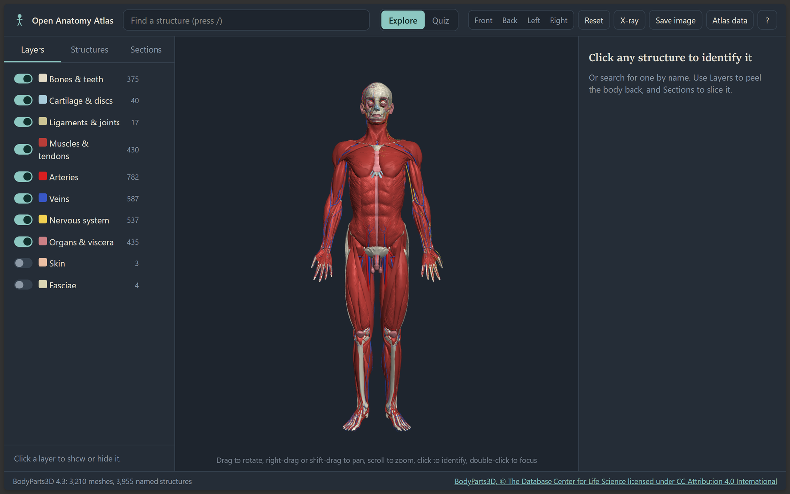
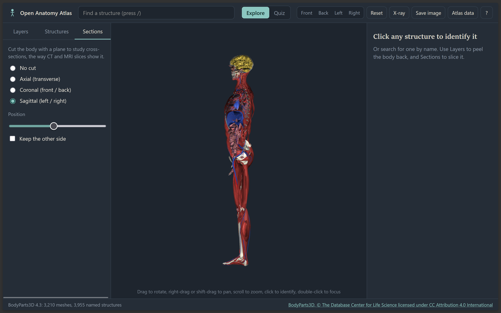

# Open Anatomy Atlas

An open-source 3D atlas of the human body for teaching and learning. You can rotate a whole body, peel it back system by system, click any structure to name it, cut sections like a CT slice, and quiz yourself.

It runs on open anatomical data that it downloads to your machine. You can install either source, or both, and switch between them:

- **BodyParts3D** from the Database Center for Life Science (Japan). This is a complete adult male body with every part named by its Foundational Model of Anatomy (FMA) term. Two releases are available: 4.0 (simplified meshes) and 4.3 (full resolution).
- **Z-Anatomy**, the open-source atlas built on BodyParts3D. It completes both sides of the body and adds ligaments, fasciae, lymphatics, brain nuclei, Latin names and definitions.



**Try it online:** https://CognitionLabSNUC.github.io/open-anatomy-atlas/ (no installation). **Install it:** see [SETUP.md](SETUP.md) or download a `.deb` / AppImage from [Releases](../../releases).

Developed by the **Cognition Lab, Shiv Nadar University Chennai**: [website](https://www.snuchennai.edu.in/cognitionlab/), [research.cognition@snuchennai.edu.in](mailto:research.cognition@snuchennai.edu.in). Version 0.0.1.

## What it does

- **Explore:** orbit, pan and zoom. Click a structure to see its name, Latin name, FMA ID and where it sits in the body (for example *Human body > Skeletal system > Femur*). Double-click to focus on it.
- **Layers:** turn bones, cartilage, ligaments, muscles, arteries, veins, the nervous system, organs, lymphatics, fasciae and skin on or off. Click "Only" to show a single layer.
- **Structures tree:** browse every named structure by region (part-of hierarchy) or by type (is-a hierarchy). Each row has a show/hide toggle.
- **Search:** press `/` and type any part of a name, such as "femur", "left coronary" or "vagus".
- **Isolate, hide and X-ray:** isolate one structure, or make everything else see-through. A selected structure that is buried still shows through whatever covers it.
- **Sections:** cut the body in axial, coronal or sagittal planes and slide the cut, the way CT and MRI slices are read.
- **Descriptions:** definitions work offline when Z-Anatomy is installed, and are also used for matching BodyParts3D structures. Otherwise a Wikipedia summary appears when you are online. Both are CC BY-SA and link back to the article.
- **Quiz:** "Find it" asks you to click the named structure. "Name it" highlights a structure and gives four choices. Questions come only from what is visible, so you can isolate a region and drill it. At the end you get a list of the ones you missed.
- **Several atlases:** install BodyParts3D 4.3, 4.0 and Z-Anatomy side by side and switch in **Atlas data**.
- **Save image:** exports the current view as a PNG for slides or handouts.
- **Runs offline** once an atlas is downloaded. If none is installed, a simple demo mannequin is shown.

## Screenshots

| | |
| --- | --- |
|  |  |
| Click to identify: name, FMA ID, location, description | X-ray: see a deep structure through the body |
|  |  |
| Peel the body back layer by layer | Quiz: find it or name it |
|  |  |
| BodyParts3D 4.3, full resolution | Sections: axial, coronal and sagittal cuts |

## The data sources compared

| | BodyParts3D 4.3 | BodyParts3D 4.0 | Z-Anatomy |
| --- | --- | --- | --- |
| Meshes | 3,210, full resolution | about 2,000, 99% simplified | 2,827, detailed |
| Left/right muscles | Both (BodyParts3D mirrored 286 itself) | Mostly right side only, so the app mirrors them | Both |
| Extras | | | Ligaments, fasciae, lymphatics, brain nuclei, Latin names, definitions |
| Download | about 200-300 MB from the Anatomography server, in batches | 62-200 MB, official bulk files | about 21 MB |
| Licence | CC BY 4.0 | CC BY 4.0 | CC BY-NC-SA 4.0 (non-commercial). A commercial-safe CC BY-SA build is available |
| Command | `npm run fetch-data:43` | `npm run fetch-data` | `npm run fetch-data:zanatomy` |

**Recommendation:** install BodyParts3D 4.3 and Z-Anatomy. Use 4.0 if you want the smallest, fastest download.

### Mirrored structures

BodyParts3D 4.0 models most limb muscles on the right side only. When the app builds an atlas, it finds muscles that exist on one side only and adds a mirror-image copy on the other side. You can still tell these copies apart:

- They are named for their side, for example "Left adductor longus".
- Their specimen tag says they are a mirror copy.
- They can be switched off with **Layers > Show mirrored copies**.
- Their mesh keys end in `M*`.

BodyParts3D 4.3 already contains its own mirrored left-side muscles (components ending in `M`), so few copies are needed there. Z-Anatomy needs none. To build without mirroring, add `--no-mirror` to the command, or untick the option in **Atlas data**.

Unsided names in the source data are labelled with the side the structure actually sits on, for example "Adductor longus (right)".

## Quick start (Linux)

You need Node.js 18 or newer (`node -v`).

```bash
npm run fetch-data:43          # BodyParts3D 4.3 (or: npm run fetch-data for 4.0)
npm run fetch-data:zanatomy    # Z-Anatomy
npm run web                    # open http://localhost:8080
```

Or run the desktop app (`npm install`, then `npm start`) and use **Atlas data** to download. See [SETUP.md](SETUP.md) for WSL, Ubuntu 24.04 sandbox notes and packaging (`.deb` / AppImage).

## Mouse and keyboard

| Action | How |
| --- | --- |
| Rotate | Drag |
| Pan | Right-drag or Shift+drag |
| Zoom | Scroll |
| Identify | Click (hover shows the name) |
| Focus | Double-click, or `F` |
| Isolate / hide | `I` / `H` |
| Show everything | `A` |
| X-ray | `X` |
| Front, back, left, right | `1` `2` `3` `4` |
| Search | `/` |

## Scope and honest limits

- This is one adult male body. There is no female or child anatomy yet.
- Mirrored copies are mirror images, not measurements, and the body is not perfectly symmetrical.
- The full-resolution atlases (4.3 has about 8.6 million triangles, Z-Anatomy about 10 million) need a reasonably modern GPU. On older or integrated graphics, BodyParts3D 4.0 is smoother.
- Names are English (FMA / Z-Anatomy), plus Latin where Z-Anatomy provides it. Other languages are not included yet.
- There are no muscle or joint animations.
- BodyParts3D 4.3 is downloaded through the endpoints the Anatomography viewer uses. These are not a documented API and could change.

## Project layout

```
src/main/        Electron main process (window, atlas:// protocol, download IPC) and preload
src/data/        pipeline: zip/OBJ/glTF+Draco readers, BodyParts3D 4.0 and 4.3 builders,
                 Z-Anatomy importer, graph + mirroring + packing, downloader, classifier
src/renderer/    the UI: WebGL2 renderer, atlas queries, Wikipedia lookup, app controller
tools/           fetch-data (CLI), serve (browser mode + small API), make-sample-data
test/            npm test: parsers, orientation, hierarchy, mirroring, 4.3 and glTF parsing
```

The app has no runtime dependencies. Electron and electron-builder are only needed to run and package it. The Draco decoder used for Z-Anatomy (Apache-2.0) is downloaded together with the Z-Anatomy files.

## Contributing ideas

- Multilingual names (FMA, Terminologia Anatomica, Z-Anatomy translations).
- Guided lessons and teacher-made quiz sets saved as JSON.
- Pin-and-label annotations that can be exported for handouts.
- An optional mesh-simplification step for low-end GPUs.

## Developed by


Open Anatomy Atlas is developed and maintained by the **Cognition Lab, Shiv Nadar University Chennai**.

- Website: https://www.snuchennai.edu.in/cognitionlab/
- Email: research.cognition@snuchennai.edu.in
Putting it on GitHub step by step: [GITHUB_SETUP.md](GITHUB_SETUP.md). More on the online version, branding and releases: [DEPLOY.md](DEPLOY.md).

## Citing

If you use Open Anatomy Atlas in teaching material or research, please cite the software (see `CITATION.cff`) and the data source you used (BodyParts3D and/or Z-Anatomy; see `NOTICE.md`).

## Contributing

Bug reports, fixes and new data sources are welcome. See [CONTRIBUTING.md](CONTRIBUTING.md). Changes are listed in [CHANGELOG.md](CHANGELOG.md).

## Licences

- Application code: MIT (see `LICENSE`).
- Anatomical data is downloaded at runtime and not bundled. Its licences are listed in `NOTICE.md`, and each atlas's attribution is shown in the status bar:
  - BodyParts3D, © The Database Center for Life Science, CC BY 4.0.
  - Z-Anatomy, CC BY-SA 4.0. Some included models (inner ear, kidney) are non-commercial.
- Descriptions come from Wikipedia under CC BY-SA, and each one links to its source.
